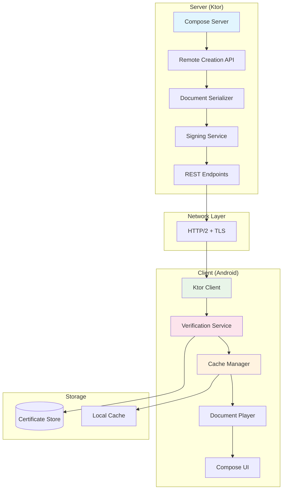

# Design Document: Remote Compose Playground

## Overview

The Remote Compose Playground demonstrates the androidx.compose.remote library capabilities by implementing a complete client-server system for remote UI delivery. The system consists of a Ktor-based server that creates and serves Remote Compose documents, and an Android client that receives, caches, and renders these documents with security verification.

The architecture leverages the official androidx.compose.remote library modules:
- **Server side**: Uses `remote-creation` modules to build Remote Compose documents
- **Client side**: Uses `remote-player` modules to render received documents
- **Shared**: Uses `remote-core` for common functionality

Key design principles:
- **Security-first**: All remote documents are cryptographically signed
- **Performance-optimized**: Client-side caching with intelligent policies
- **Resilient**: Graceful degradation when network or server issues occur
- **Library-compliant**: Proper usage of androidx.compose.remote APIs

## Architecture



### Component Interaction Flow

1. **Document Creation**: Server uses Remote Creation API to build Remote Compose documents
2. **Signing**: Documents are cryptographically signed before transmission
3. **Network Transfer**: Ktor client/server handle HTTP/2 communication
4. **Verification**: Client verifies document signatures before processing
5. **Caching**: Valid documents are cached with time-based policies
6. **Rendering**: Document Player renders cached or fresh documents in Compose UI

## Components and Interfaces

### Server Components

#### Remote Compose Server
```kotlin
interface RemoteComposeServer {
    suspend fun createDocument(templateId: String, parameters: Map<String, Any>): RemoteDocument
    suspend fun serveDocument(documentId: String): SignedDocument
    fun startServer(port: Int)
    fun stopServer()
}

class KtorRemoteComposeServer(
    private val creationApi: RemoteCreationApi,
    private val signingService: SigningService
) : RemoteComposeServer
```

#### Remote Creation API Wrapper
```kotlin
interface RemoteCreationApi {
    fun createDocument(builder: RemoteDocumentBuilder.() -> Unit): RemoteDocument
    fun createColumn(content: List<RemoteComponent>): RemoteComponent
    fun createText(text: String, style: TextStyle? = null): RemoteComponent
    fun createButton(text: String, onClick: RemoteAction): RemoteComponent
}

class AndroidXRemoteCreationApi : RemoteCreationApi {
    // Wraps androidx.compose.remote.creation APIs
}
```

#### Document Signing Service
```kotlin
interface SigningService {
    suspend fun signDocument(document: RemoteDocument): SignedDocument
    fun generateKeyPair(): KeyPair
    fun getPublicKey(): PublicKey
}

data class SignedDocument(
    val document: RemoteDocument,
    val signature: ByteArray,
    val timestamp: Long,
    val keyId: String
)
```

### Client Components

#### Ktor Client Manager
```kotlin
interface KtorClientManager {
    suspend fun fetchDocument(documentId: String): SignedDocument
    suspend fun fetchDocumentList(): List<DocumentMetadata>
    fun configure(config: ClientConfig)
}

data class ClientConfig(
    val baseUrl: String,
    val timeout: Duration,
    val retryPolicy: RetryPolicy,
    val enableHttp2: Boolean = true
)
```

#### Document Verification Service
```kotlin
interface DocumentVerificationService {
    suspend fun verifyDocument(signedDocument: SignedDocument): VerificationResult
    fun addTrustedCertificate(certificate: X509Certificate)
    fun removeTrustedCertificate(keyId: String)
}

sealed class VerificationResult {
    object Valid : VerificationResult()
    data class Invalid(val reason: String) : VerificationResult()
    data class Expired(val expiredAt: Long) : VerificationResult()
}
```

#### Cache Manager
```kotlin
interface CacheManager {
    suspend fun get(documentId: String): CachedDocument?
    suspend fun put(documentId: String, document: RemoteDocument, ttl: Duration)
    suspend fun invalidate(documentId: String)
    suspend fun clear()
    fun getMetrics(): CacheMetrics
}

data class CachedDocument(
    val document: RemoteDocument,
    val cachedAt: Long,
    val expiresAt: Long,
    val hitCount: Int
)

data class CacheMetrics(
    val hitRate: Double,
    val missRate: Double,
    val evictionCount: Long,
    val totalSize: Long
)
```

#### Document Player Wrapper
```kotlin
interface DocumentPlayerWrapper {
    @Composable
    fun RenderDocument(
        document: RemoteDocument,
        modifier: Modifier = Modifier,
        onError: (Throwable) -> Unit = {}
    )
    
    fun preloadDocument(document: RemoteDocument)
    fun getCapabilities(): Set<RemoteCapability>
}

class AndroidXDocumentPlayer : DocumentPlayerWrapper {
    // Wraps androidx.compose.remote.player APIs
}
```

### Data Models

#### Remote Document Extensions
```kotlin
// Extensions to androidx.compose.remote types
data class DocumentMetadata(
    val id: String,
    val version: String,
    val title: String,
    val description: String,
    val createdAt: Long,
    val updatedAt: Long,
    val tags: List<String>
)

data class RemoteAction(
    val type: ActionType,
    val parameters: Map<String, Any>
)

enum class ActionType {
    NAVIGATION,
    API_CALL,
    STATE_UPDATE,
    CUSTOM
}
```

#### Configuration Models
```kotlin
data class TimePolicy(
    val defaultTtl: Duration = 1.hours,
    val maxTtl: Duration = 24.hours,
    val refreshThreshold: Duration = 5.minutes,
    val backgroundRefresh: Boolean = true
)

data class SecurityConfig(
    val requireSignature: Boolean = true,
    val allowedKeyIds: Set<String>,
    val certificateValidityPeriod: Duration = 365.days,
    val enableCertificatePinning: Boolean = true
)
```

## Data Models

### Core Data Structures

The system primarily works with androidx.compose.remote data structures, extended with metadata and security information:

```kotlin
// Core androidx.compose.remote types (referenced, not implemented)
// - RemoteDocument: The main document structure
// - RemoteComponent: Individual UI components
// - RemoteState: State management for remote components

// Custom extensions
data class PlaygroundDocument(
    val metadata: DocumentMetadata,
    val remoteDocument: RemoteDocument,
    val securityInfo: SecurityInfo
)

data class SecurityInfo(
    val signature: ByteArray,
    val keyId: String,
    val signedAt: Long,
    val algorithm: String = "SHA256withRSA"
)
```

### Serialization Strategy

The system uses the built-in androidx.compose.remote serialization with additional security layers:

```kotlin
interface DocumentSerializer {
    fun serialize(document: RemoteDocument): ByteArray
    fun deserialize(data: ByteArray): RemoteDocument
    fun serializeWithSecurity(signedDocument: SignedDocument): ByteArray
    fun deserializeWithSecurity(data: ByteArray): SignedDocument
}
```

## Error Handling

### Error Categories

1. **Network Errors**: Connection failures, timeouts, HTTP errors
2. **Security Errors**: Invalid signatures, expired certificates, untrusted sources
3. **Serialization Errors**: Malformed documents, version mismatches
4. **Rendering Errors**: Unsupported components, runtime exceptions
5. **Cache Errors**: Storage failures, corruption, capacity limits

### Error Handling Strategy

```kotlin
sealed class RemoteComposeError : Exception() {
    data class NetworkError(val cause: Throwable) : RemoteComposeError()
    data class SecurityError(val reason: String) : RemoteComposeError()
    data class SerializationError(val cause: Throwable) : RemoteComposeError()
    data class RenderingError(val component: String, val cause: Throwable) : RemoteComposeError()
    data class CacheError(val operation: String, val cause: Throwable) : RemoteComposeError()
}

interface ErrorHandler {
    suspend fun handleError(error: RemoteComposeError): ErrorRecoveryAction
    fun logError(error: RemoteComposeError, context: Map<String, Any>)
}

sealed class ErrorRecoveryAction {
    object RetryWithBackoff : ErrorRecoveryAction()
    object UseCachedContent : ErrorRecoveryAction()
    object ShowErrorUI : ErrorRecoveryAction()
    object FailSilently : ErrorRecoveryAction()
}
```

### Circuit Breaker Implementation

```kotlin
class CircuitBreaker(
    private val failureThreshold: Int = 5,
    private val recoveryTimeout: Duration = 30.seconds,
    private val halfOpenMaxCalls: Int = 3
) {
    private var state: CircuitState = CircuitState.CLOSED
    private var failureCount: Int = 0
    private var lastFailureTime: Long = 0
    
    suspend fun <T> execute(operation: suspend () -> T): T {
        when (state) {
            CircuitState.OPEN -> {
                if (shouldAttemptReset()) {
                    state = CircuitState.HALF_OPEN
                } else {
                    throw CircuitBreakerOpenException()
                }
            }
            CircuitState.HALF_OPEN -> {
                // Limited calls allowed
            }
            CircuitState.CLOSED -> {
                // Normal operation
            }
        }
        
        return try {
            val result = operation()
            onSuccess()
            result
        } catch (e: Exception) {
            onFailure()
            throw e
        }
    }
}
```

## Testing Strategy

### Dual Testing Approach

The system requires both unit testing and property-based testing to ensure comprehensive coverage:

**Unit Tests**:
- Specific examples and edge cases for each component
- Integration points between server and client
- Error conditions and recovery scenarios
- Security verification edge cases

**Property-Based Tests**:
- Universal properties that hold across all inputs
- Comprehensive input coverage through randomization
- Minimum 100 iterations per property test
- Each test tagged with: **Feature: remote-compose-playground, Property {number}: {property_text}**

### Property-Based Testing Configuration

The system will use **Kotest Property Testing** for Kotlin, configured as follows:
- Minimum 100 iterations per property test
- Custom generators for RemoteDocument, SecurityInfo, and CachePolicy
- Shrinking enabled to find minimal failing cases
- Timeout configuration for long-running tests

### Testing Libraries

- **Unit Testing**: JUnit 5 + MockK for mocking
- **Property Testing**: Kotest Property Testing
- **Integration Testing**: Ktor Test Engine + TestContainers
- **UI Testing**: Compose Testing + Espresso for Android components
## Correctness Properties

*A property is a characteristic or behavior that should hold true across all valid executions of a system—essentially, a formal statement about what the system should do. Properties serve as the bridge between human-readable specifications and machine-verifiable correctness guarantees.*

Based on the prework analysis and property reflection to eliminate redundancy, the following properties validate the system's correctness:

### Property 1: Remote Document Round-Trip Consistency
*For any* valid Remote_Document instance, serializing it using the androidx.compose.remote library then deserializing it should produce an equivalent document with all layout properties and behavior definitions preserved.
**Validates: Requirements 4.3, 4.5**

### Property 2: Document Creation API Compliance
*For any* document specification, the Remote_Compose_Server should successfully create Remote_Document instances using only androidx.compose.remote.creation APIs according to library specifications.
**Validates: Requirements 1.1, 7.4**

### Property 3: Document Rendering API Compliance
*For any* valid Remote_Document instance, the Remote_Compose_Client should successfully render it using only androidx.compose.remote.player APIs according to library specifications.
**Validates: Requirements 2.1, 2.2, 7.5**

### Property 4: Concurrent Server Access
*For any* number of concurrent client requests, the Remote_Compose_Server should handle all requests successfully and return the correct Remote_Document for each request.
**Validates: Requirements 1.4**

### Property 5: Cache-First Behavior
*For any* cached Remote_Document that has not expired, requesting that document should return the cached version without making a network request.
**Validates: Requirements 5.2**

### Property 6: Cache Expiration and Refresh
*For any* cached Remote_Document, when the Time_Policy expiration time is reached, the next request should fetch fresh content from the server and update the cache.
**Validates: Requirements 5.3, 5.4**

### Property 7: Cache Persistence Across Restarts
*For any* Remote_Document cached before an app restart, it should remain available in the cache after restart until its expiration time.
**Validates: Requirements 5.5**

### Property 8: LRU Cache Eviction
*For any* cache at capacity, adding a new Remote_Document should evict the least recently used document while preserving all other documents.
**Validates: Requirements 5.6**

### Property 9: Document Signature Verification
*For any* Remote_Document with a valid Code_Signature, the Remote_Compose_Client should successfully verify the signature and allow rendering; for any document with an invalid signature, verification should fail and rendering should be prevented.
**Validates: Requirements 6.2, 6.3, 6.5**

### Property 10: Signature Integrity Coverage
*For any* signed Remote_Document, modifying any part of the serialized document should cause signature verification to fail.
**Validates: Requirements 6.6**

### Property 11: Network Retry with Exponential Backoff
*For any* network request that fails, the Ktor_Client should retry the request with exponentially increasing delays between attempts.
**Validates: Requirements 3.5**

### Property 12: Offline Fallback Behavior
*For any* Remote_Document request when network is unavailable, if a cached version exists and is valid, it should be returned; if no cached version exists, an appropriate error should be returned.
**Validates: Requirements 9.1**

### Property 13: Malformed Response Handling
*For any* malformed server response, the Remote_Compose_Client should log the error and fall back to cached content if available, or display an error message if no cache exists.
**Validates: Requirements 9.2, 9.3**

### Property 14: Circuit Breaker Activation
*For any* sequence of consecutive failures exceeding the threshold, the circuit breaker should open and prevent further requests until the recovery timeout period.
**Validates: Requirements 9.4**

### Property 15: Configuration Application
*For any* valid Time_Policy or connection configuration, applying the configuration should result in the system behaving according to the new parameters.
**Validates: Requirements 8.1, 8.2**

### Property 16: Certificate Rotation Support
*For any* certificate update operation, the Remote_Compose_Client should continue to verify signatures correctly using the new certificate without requiring app restart.
**Validates: Requirements 8.3**

### Property 17: Cache Metrics Accuracy
*For any* sequence of cache operations (hits, misses, evictions), the Cache_Manager metrics should accurately reflect the actual cache behavior.
**Validates: Requirements 8.4**