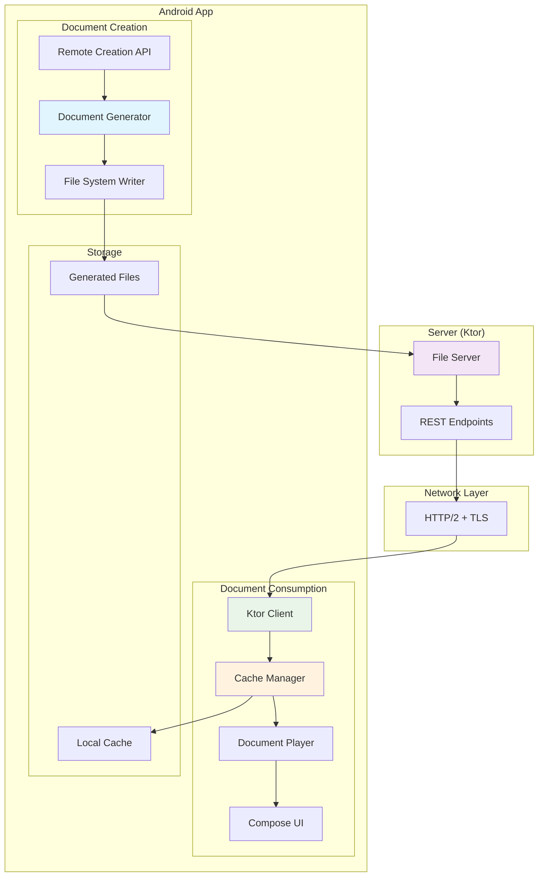

# Design Document: Remote Compose Playground

## Overview

The Remote Compose Playground demonstrates the androidx.compose.remote library capabilities by implementing a system where an Android app generates Remote Compose documents and serves them to itself via a simple file server. The system consists of a lightweight Ktor-based file server that serves pre-generated Remote Compose documents, and an Android client that creates, saves, caches, and renders these documents.

The architecture leverages the official androidx.compose.remote library modules:
- **Android app only**: Uses both `remote-creation` modules to build documents and `remote-player` modules to render them
- **Server side**: Simple file server with no Remote Compose dependencies (serves pre-generated files)
- **Document flow**: Android app generates documents → saves to files → server serves files → Android app fetches and renders

Key design principles:
- **Android-centric**: All Remote Compose functionality contained within the Android app
- **File-based serving**: Server serves pre-generated document files without Remote Compose processing
- **Self-contained demo**: Single Android app demonstrates both creation and playback capabilities
- **Library-compliant**: Proper usage of androidx.compose.remote APIs within Android app

## Architecture



### Component Interaction Flow

1. **Document Creation**: Android app uses Remote Creation API to build Remote Compose documents
2. **File Generation**: Documents are serialized and saved to files using `doc.buffer.buffer.cloneBytes()`
3. **File Serving**: Simple Ktor server serves the pre-generated document files
4. **Network Transfer**: Ktor client fetches documents from the file server
5. **Caching**: Valid documents are cached with time-based policies
6. **Rendering**: Document Player renders cached or fresh documents in Compose UI

## Components and Interfaces

### Server Components

#### Simple File Server
```kotlin
interface FileServer {
    suspend fun serveDocument(documentId: String): ByteArray
    suspend fun listDocuments(): List<DocumentMetadata>
    fun startServer(port: Int)
    fun stopServer()
}

class KtorFileServer(
    private val documentsDirectory: String
) : FileServer {
    // Simple file serving - no Remote Compose dependencies
    // Serves pre-generated document files from filesystem
}
```

### Android App Components

#### Remote Creation Service
```kotlin
interface RemoteCreationService {
    @Composable
    fun createDocument(builder: @Composable () -> Unit): RemoteDocument
    suspend fun saveDocumentToFile(document: RemoteDocument, filename: String)
    fun generateSampleDocuments()
}

class RemoteCreationService {
    // Uses androidx.compose.remote.creation APIs directly
    // Generates documents using RememberRemoteDocumentInline
    // Saves using doc.buffer.buffer.cloneBytes()
}
```

#### Document Generator
```kotlin
interface DocumentGenerator {
    @Composable
    fun GenerateAndSaveDocument(
        documentId: String,
        content: @Composable () -> Unit,
        onDocumentGenerated: (RemoteDocument) -> Unit
    )
    
    suspend fun saveDocumentBytes(documentId: String, bytes: ByteArray)
}

class DocumentGenerator(
    private val fileSystem: FileSystemManager
) : DocumentGenerator {
    // Uses RememberRemoteDocumentInline to generate documents
    // Extracts bytes using doc.buffer.buffer.cloneBytes()
    // Saves to files for server to serve
}
```

#### Ktor Client Manager
```kotlin
interface KtorClientManager {
    suspend fun fetchDocument(documentId: String): ByteArray
    suspend fun fetchDocumentList(): List<DocumentMetadata>
    fun configure(config: ClientConfig)
}

data class ClientConfig(
    val baseUrl: String,
    val timeout: Duration,
    val retryPolicy: RetryPolicy,
    val enableHttp2: Boolean = true
)
```

#### Cache Manager
```kotlin
interface CacheManager {
    suspend fun get(documentId: String): CachedDocument?
    suspend fun put(documentId: String, document: RemoteDocument, ttl: Duration)
    suspend fun invalidate(documentId: String)
    suspend fun clear()
    fun getMetrics(): CacheMetrics
}

data class CachedDocument(
    val document: RemoteDocument,
    val cachedAt: Long,
    val expiresAt: Long,
    val hitCount: Int
)

data class CacheMetrics(
    val hitRate: Double,
    val missRate: Double,
    val evictionCount: Long,
    val totalSize: Long
)
```

#### Document Player Service
```kotlin
interface DocumentPlayerService {
    @Composable
    fun RenderDocument(
        document: RemoteDocument,
        modifier: Modifier = Modifier,
        onError: (Throwable) -> Unit = {}
    )
    
    fun preloadDocument(document: RemoteDocument)
    fun getCapabilities(): Set<RemoteCapability>
}

class DocumentPlayerService {
    // Uses androidx.compose.remote.player APIs directly
    // Renders documents using RemoteDocumentPlayer
    // No wrapper functions needed - library provides direct rendering capabilities
}
```

#### File System Manager
```kotlin
interface FileSystemManager {
    suspend fun saveDocument(documentId: String, bytes: ByteArray)
    suspend fun loadDocument(documentId: String): ByteArray?
    suspend fun deleteDocument(documentId: String)
    suspend fun listDocuments(): List<String>
    fun getDocumentsDirectory(): String
}

class FileSystemManager(
    private val context: Context
) : FileSystemManager {
    // Manages local file storage for generated documents
    // Provides documents directory for server to serve from
}
```

### Data Models

#### Remote Document Extensions
```kotlin
// Extensions to androidx.compose.remote types
data class DocumentMetadata(
    val id: String,
    val version: String,
    val title: String,
    val description: String,
    val createdAt: Long,
    val updatedAt: Long,
    val tags: List<String>,
    val filePath: String // Path to the generated file
)

data class GeneratedDocument(
    val metadata: DocumentMetadata,
    val bytes: ByteArray, // From doc.buffer.buffer.cloneBytes()
    val generatedAt: Long
)

data class RemoteAction(
    val type: ActionType,
    val parameters: Map<String, Any>
)

enum class ActionType {
    NAVIGATION,
    API_CALL,
    STATE_UPDATE,
    CUSTOM
}
```

#### Configuration Models
```kotlin
data class TimePolicy(
    val defaultTtl: Duration = 1.hours,
    val maxTtl: Duration = 24.hours,
    val refreshThreshold: Duration = 5.minutes,
    val backgroundRefresh: Boolean = true
)

data class FileServerConfig(
    val documentsDirectory: String,
    val port: Int = 8080,
    val enableCors: Boolean = true,
    val maxFileSize: Long = 10 * 1024 * 1024 // 10MB
)
```

## Data Models

### Core Data Structures

The system primarily works with androidx.compose.remote data structures, with file-based storage and serving:

```kotlin
// Core androidx.compose.remote types (referenced, not implemented)
// - RemoteDocument: The main document structure
// - RemoteComponent: Individual UI components
// - RemoteState: State management for remote components

// Custom extensions for file-based workflow
data class PlaygroundDocument(
    val metadata: DocumentMetadata,
    val remoteDocument: RemoteDocument,
    val fileInfo: FileInfo
)

data class FileInfo(
    val filePath: String,
    val fileSize: Long,
    val createdAt: Long,
    val checksum: String // For integrity verification
)
```

### Serialization Strategy

The system uses the built-in androidx.compose.remote serialization with file-based storage:

```kotlin
interface DocumentSerializer {
    fun serialize(document: RemoteDocument): ByteArray
    fun deserialize(data: ByteArray): RemoteDocument
    suspend fun saveToFile(document: RemoteDocument, filePath: String)
    suspend fun loadFromFile(filePath: String): RemoteDocument
}

class DocumentSerializer {
    // Uses doc.buffer.buffer.cloneBytes() for extraction
    // Saves raw bytes to files for server serving
}
```

## Error Handling

### Error Categories

1. **Network Errors**: Connection failures, timeouts, HTTP errors
2. **File System Errors**: File not found, permission issues, disk space
3. **Serialization Errors**: Malformed documents, version mismatches
4. **Rendering Errors**: Unsupported components, runtime exceptions
5. **Cache Errors**: Storage failures, corruption, capacity limits

### Error Handling Strategy

```kotlin
sealed class RemoteComposeError : Exception() {
    data class NetworkError(val cause: Throwable) : RemoteComposeError()
    data class FileSystemError(val operation: String, val cause: Throwable) : RemoteComposeError()
    data class SerializationError(val cause: Throwable) : RemoteComposeError()
    data class RenderingError(val component: String, val cause: Throwable) : RemoteComposeError()
    data class CacheError(val operation: String, val cause: Throwable) : RemoteComposeError()
}

interface ErrorHandler {
    suspend fun handleError(error: RemoteComposeError): ErrorRecoveryAction
    fun logError(error: RemoteComposeError, context: Map<String, Any>)
}

sealed class ErrorRecoveryAction {
    object RetryWithBackoff : ErrorRecoveryAction()
    object UseCachedContent : ErrorRecoveryAction()
    object RegenerateDocument : ErrorRecoveryAction()
    object ShowErrorUI : ErrorRecoveryAction()
    object FailSilently : ErrorRecoveryAction()
}
```

### Circuit Breaker Implementation

```kotlin
class CircuitBreaker(
    private val failureThreshold: Int = 5,
    private val recoveryTimeout: Duration = 30.seconds,
    private val halfOpenMaxCalls: Int = 3
) {
    private var state: CircuitState = CircuitState.CLOSED
    private var failureCount: Int = 0
    private var lastFailureTime: Long = 0
    
    suspend fun <T> execute(operation: suspend () -> T): T {
        when (state) {
            CircuitState.OPEN -> {
                if (shouldAttemptReset()) {
                    state = CircuitState.HALF_OPEN
                } else {
                    throw CircuitBreakerOpenException()
                }
            }
            CircuitState.HALF_OPEN -> {
                // Limited calls allowed
            }
            CircuitState.CLOSED -> {
                // Normal operation
            }
        }
        
        return try {
            val result = operation()
            onSuccess()
            result
        } catch (e: Exception) {
            onFailure()
            throw e
        }
    }
}
```

## Testing Strategy

### Dual Testing Approach

The system requires both unit testing and property-based testing to ensure comprehensive coverage:

**Unit Tests**:
- Specific examples and edge cases for each component
- Integration points between server and client
- Error conditions and recovery scenarios
- Security verification edge cases

**Property-Based Tests**:
- Universal properties that hold across all inputs
- Comprehensive input coverage through randomization
- Minimum 100 iterations per property test
- Each test tagged with: **Feature: remote-compose-playground, Property {number}: {property_text}**

### Property-Based Testing Configuration

The system will use **Kotest Property Testing** for Kotlin, configured as follows:
- Minimum 100 iterations per property test
- Custom generators for RemoteDocument, SecurityInfo, and CachePolicy
- Shrinking enabled to find minimal failing cases
- Timeout configuration for long-running tests

### Testing Libraries

- **Unit Testing**: JUnit 5 + MockK for mocking
- **Property Testing**: Kotest Property Testing
- **Integration Testing**: Ktor Test Engine + TestContainers
- **UI Testing**: Compose Testing + Espresso for Android components
## Correctness Properties

*A property is a characteristic or behavior that should hold true across all valid executions of a system—essentially, a formal statement about what the system should do. Properties serve as the bridge between human-readable specifications and machine-verifiable correctness guarantees.*

Based on the prework analysis and property reflection to eliminate redundancy, the following properties validate the system's correctness under the new architecture where the Android app handles both document creation and playback:

### Property 1: Document Creation Using Remote Creation APIs
*For any* document specification, the Android app should successfully create Remote_Document instances using androidx.compose.remote.creation APIs according to library specifications.
**Validates: Requirements 1.1, 6.4**

### Property 2: Document Serialization Round-Trip Consistency
*For any* valid Remote_Document instance created by the Android app, extracting bytes using `doc.buffer.buffer.cloneBytes()` then deserializing should produce an equivalent document with all layout properties and behavior definitions preserved.
**Validates: Requirements 1.2, 4.3**

### Property 3: File Server Document Serving
*For any* document file generated by the Android app, the file server should successfully serve the file contents over HTTP when requested.
**Validates: Requirements 1.3**

### Property 4: Concurrent File Server Access
*For any* number of concurrent client requests to the file server, all requests should be handled successfully and return the correct file contents for each request.
**Validates: Requirements 1.4**

### Property 5: Document Update Availability
*For any* document file updated by the Android app, the file server should immediately serve the new version on subsequent requests.
**Validates: Requirements 1.5**

### Property 6: Document Rendering Using Player APIs
*For any* valid Remote_Document instance, the Android app should successfully render it using androidx.compose.remote.player APIs according to library specifications.
**Validates: Requirements 2.1, 6.5**

### Property 7: Document Deserialization and Rendering
*For any* Remote_Document received from the server, the Document_Player should successfully deserialize and render it within the Compose UI tree.
**Validates: Requirements 2.2**

### Property 8: Remote UI Event Handling
*For any* UI event occurring in remote components, the Document_Player should handle the event according to the Remote_Document specifications.
**Validates: Requirements 2.4**

### Property 9: Remote and Local UI Integration
*For any* combination of remote and local Compose components, they should integrate seamlessly within the same UI tree.
**Validates: Requirements 2.5**

### Property 10: Network Retry with Exponential Backoff
*For any* network request that fails, the Ktor_Client should retry the request with exponentially increasing delays between attempts.
**Validates: Requirements 3.5**

### Property 11: Cache Storage with Timestamps
*For any* Remote_Document received by the Android app, the Cache_Manager should store it locally with an accurate timestamp.
**Validates: Requirements 4.1**

### Property 12: Cache-First Behavior
*For any* cached Remote_Document that has not expired, requesting that document should return the cached version without making a network request.
**Validates: Requirements 4.2**

### Property 13: Cache Expiration and Refresh
*For any* cached Remote_Document, when the Time_Policy expiration time is reached, the next request should fetch fresh content from the server and update the cache.
**Validates: Requirements 4.3, 4.4**

### Property 14: Cache Persistence Across Restarts
*For any* Remote_Document cached before an app restart, it should remain available in the cache after restart until its expiration time.
**Validates: Requirements 4.5**

### Property 15: LRU Cache Eviction
*For any* cache at capacity, adding a new Remote_Document should evict the least recently used document while preserving all other documents.
**Validates: Requirements 4.6**

### Property 16: Configuration Application
*For any* valid Time_Policy or connection configuration, applying the configuration should result in the system behaving according to the new parameters.
**Validates: Requirements 7.1, 7.2**

### Property 17: Cache Metrics Accuracy
*For any* sequence of cache operations (hits, misses, evictions), the Cache_Manager metrics should accurately reflect the actual cache behavior.
**Validates: Requirements 7.4**

### Property 18: Offline Fallback Behavior
*For any* Remote_Document request when network is unavailable, if a cached version exists and is valid, it should be returned; if no cached version exists, an appropriate error should be returned.
**Validates: Requirements 8.1**

### Property 19: Malformed Response Handling
*For any* malformed server response, the Remote_Compose_Client should log the error and fall back to cached content if available.
**Validates: Requirements 8.2**

### Property 20: Circuit Breaker Activation
*For any* sequence of consecutive failures exceeding the threshold, the circuit breaker should open and prevent further requests until the recovery timeout period.
**Validates: Requirements 8.4**

### Property 21: Partial Content Handling
*For any* incomplete transfer or partial content received, the Remote_Compose_Client should handle the situation gracefully without crashing.
**Validates: Requirements 8.5**